# Engineering Report — Depth Extrapolation of the Sum-Decomposition Surrogate (1→10 layers)

**Author:** Arghya Ranjan Das · **Date:** 2026-06-11 · **Target:** Catapult HLS ASIC (nangate-45nm)
**Model:** `FPGA_GNN_SumDecomp` (small, 1.70M params) · **Repo:** `wa_hls4ml_models @ Catapult-ASIC-dev`

---

## 1. TL;DR

Can a surrogate trained on **shallow** MLPs predict the HLS cost of **deeper, unseen** MLPs?
We measured the full depth ladder on the 45nm Catapult data, for **both backbones, 4 random seeds
per entry** (mean ± std; **bold** = better backbone for that cell):

<table>
  <thead>
    <tr>
      <th rowspan="2">Run</th><th rowspan="2">Train<br>depths</th>
      <th rowspan="2">Test depth<br>(distance)</th><th rowspan="2">n(test)</th>
      <th colspan="2">small SumDecomp · 1.70M</th>
      <th colspan="2">GATv2-SumDecomp · 54M</th>
      <th rowspan="2">THRU-<br>PUT</th>
    </tr>
    <tr><th>LATENCY R²</th><th>AREA R²</th><th>LATENCY R²</th><th>AREA R²</th></tr>
  </thead>
  <tbody>
    <tr><td><b>A</b></td><td rowspan="6">1, 2</td><td>3 (d-1)</td><td>405,000</td><td><b>0.982 ± 0.018</b></td><td><b>0.964 ± 0.025</b></td><td>0.957 ± 0.016</td><td>0.904 ± 0.063</td><td rowspan="20">1.000<br>exact<br>(LUT)</td></tr>
    <tr><td><b>B</b></td><td>4 (d-2)</td><td>9,972</td><td><b>0.982 ± 0.018</b></td><td><b>0.940 ± 0.034</b></td><td>0.957 ± 0.016</td><td>0.892 ± 0.064</td></tr>
    <tr><td><b>D</b></td><td>5 (d-3)</td><td>10,000</td><td><b>0.984 ± 0.015</b></td><td><b>0.926 ± 0.039</b></td><td>0.962 ± 0.012</td><td>0.876 ± 0.071</td></tr>
    <tr><td><b>G</b></td><td>6 (d-4)</td><td>10,000</td><td><b>0.986 ± 0.011</b></td><td><b>0.913 ± 0.039</b></td><td>0.966 ± 0.009</td><td>0.860 ± 0.071</td></tr>
    <tr><td><b>K</b></td><td>8 (d-6)</td><td>10,000</td><td><b>0.987 ± 0.010</b></td><td><b>0.904 ± 0.040</b></td><td>0.970 ± 0.008</td><td>0.854 ± 0.072</td></tr>
    <tr><td><b>L</b></td><td>10 (d-8)</td><td>10,000</td><td><b>0.989 ± 0.008</b></td><td><b>0.884 ± 0.047</b></td><td>0.972 ± 0.007</td><td>0.836 ± 0.078</td></tr>
    <tr><td><b>C</b></td><td rowspan="5">1, 2, 3</td><td>4 (d-1)</td><td>9,972</td><td><b>0.992 ± 0.009</b></td><td>0.969 ± 0.012</td><td>0.977 ± 0.012</td><td><b>0.984 ± 0.019</b></td></tr>
    <tr><td><b>E</b></td><td>5 (d-2)</td><td>10,000</td><td><b>0.993 ± 0.008</b></td><td>0.967 ± 0.011</td><td>0.979 ± 0.010</td><td><b>0.979 ± 0.023</b></td></tr>
    <tr><td><b>H</b></td><td>6 (d-3)</td><td>10,000</td><td><b>0.993 ± 0.007</b></td><td>0.966 ± 0.012</td><td>0.980 ± 0.007</td><td><b>0.975 ± 0.024</b></td></tr>
    <tr><td><b>M</b></td><td>8 (d-5)</td><td>10,000</td><td><b>0.994 ± 0.006</b></td><td>0.964 ± 0.014</td><td>0.982 ± 0.006</td><td><b>0.973 ± 0.026</b></td></tr>
    <tr><td><b>N</b></td><td>10 (d-7)</td><td>10,000</td><td><b>0.994 ± 0.006</b></td><td>0.962 ± 0.019</td><td>0.983 ± 0.005</td><td><b>0.967 ± 0.030</b></td></tr>
    <tr><td><b>F</b></td><td rowspan="4">1, 2, 3, 4</td><td>5 (d-1)</td><td>10,000</td><td><b>0.996 ± 0.004</b></td><td><b>0.982 ± 0.009</b></td><td>0.987 ± 0.006</td><td>0.980 ± 0.011</td></tr>
    <tr><td><b>I</b></td><td>6 (d-2)</td><td>10,000</td><td><b>0.996 ± 0.003</b></td><td><b>0.980 ± 0.010</b></td><td>0.988 ± 0.005</td><td>0.976 ± 0.012</td></tr>
    <tr><td><b>O</b></td><td>8 (d-4)</td><td>10,000</td><td><b>0.996 ± 0.003</b></td><td><b>0.977 ± 0.010</b></td><td>0.989 ± 0.005</td><td>0.972 ± 0.013</td></tr>
    <tr><td><b>P</b></td><td>10 (d-6)</td><td>10,000</td><td><b>0.996 ± 0.003</b></td><td><b>0.973 ± 0.014</b></td><td>0.989 ± 0.005</td><td>0.966 ± 0.015</td></tr>
    <tr><td><b>J</b></td><td rowspan="3">1, 2, 3, 4, 5</td><td>6 (d-1)</td><td>10,000</td><td><b>1.000 ± 0.000</b></td><td>0.971 ± 0.013</td><td>0.978 ± 0.012</td><td><b>0.980 ± 0.005</b></td></tr>
    <tr><td><b>Q</b></td><td>8 (d-3)</td><td>10,000</td><td><b>1.000 ± 0.000</b></td><td>0.972 ± 0.013</td><td>0.980 ± 0.010</td><td><b>0.977 ± 0.005</b></td></tr>
    <tr><td><b>R</b></td><td>10 (d-5)</td><td>10,000</td><td><b>1.000 ± 0.000</b></td><td><b>0.975 ± 0.012</b></td><td>0.981 ± 0.009</td><td>0.971 ± 0.006</td></tr>
    <tr><td><b>S</b></td><td rowspan="2">1, 2, 3, 4, 5, 6</td><td>8 (d-2)</td><td>10,000</td><td><b>0.996 ± 0.004</b></td><td><b>0.977 ± 0.003</b></td><td>0.959 ± 0.021</td><td>0.917 ± 0.069</td></tr>
    <tr><td><b>T</b></td><td>10 (d-4)</td><td>10,000</td><td><b>0.996 ± 0.004</b></td><td><b>0.974 ± 0.005</b></td><td>0.964 ± 0.020</td><td>0.903 ± 0.079</td></tr>
  </tbody>
</table>

*All entries are 4 seeds; **evaluation-only** reuse of checkpoints wherever the train set is unchanged (B/D/G/K/L reuse A's; E/H/M/N reuse C's; I/O/P reuse F's; Q/R reuse J's; only the diagonal A/C/F/J and the new {1..6} runs are trained). **Every test set is now the full 10,000-design RF{1,4,8,16} release** — the earlier 6-layer caveat is gone (§9). **Headline: LATENCY is essentially distance-invariant** — the small model holds 0.98–0.99 from 2-layer training all the way out to a **10-layer** test (distance 8); AREA decays smoothly with distance (0.96 → 0.88 over distance 1→8) and **every extra training depth lifts it back toward 1.0** (at the 10-layer test, area climbs 0.884 → 0.962 → 0.973 → 0.975 as training deepens from ≤2 to ≤5). Details: small §6.1–6.3, GATv2 §6.4, mechanism §7.*

> **Correction vs the earlier draft.** A previous 6-layer point reported small-model latency dropping to 0.904 at distance 4. That was an **artifact of the RF{1,4}-only subset** (5,000 designs, a compressed latency range that deflates R²). On the full RF{1,4,8,16} 6-layer set the *same* checkpoints score **0.986**, and latency holds that level out to distance 8. **There is no latency break.**

**Best-seed view — what each backbone can actually achieve** (single best seed per training config,
chosen by mean test-R² across its depths; cells show **R² (SMAPE)**; merged **Train** column; **bold** = better backbone):

<table>
  <thead>
    <tr>
      <th rowspan="2">Run</th><th rowspan="2">Train</th><th rowspan="2">Test</th>
      <th colspan="2">small GATv2 SumDecomp · 1.70M</th>
      <th colspan="2">Larger GATv2 SumDecomp · 54M</th>
    </tr>
    <tr><th>LATENCY<br>R² (SMAPE)</th><th>AREA<br>R² (SMAPE)</th><th>LATENCY<br>R² (SMAPE)</th><th>AREA<br>R² (SMAPE)</th></tr>
  </thead>
  <tbody>
    <tr><td><b>A</b></td><td rowspan="6">{1,2}</td><td>3</td><td><b>0.9954 (4.9%)</b></td><td><b>0.9797 (11.3%)</b></td><td>0.9774 (7.8%)</td><td>0.9622 (9.0%)</td></tr>
    <tr><td><b>B</b></td><td>4</td><td><b>0.9958 (5.1%)</b></td><td>0.9562 (13.8%)</td><td>0.9769 (8.2%)</td><td><b>0.9587 (10.9%)</b></td></tr>
    <tr><td><b>D</b></td><td>5</td><td><b>0.9959 (5.1%)</b></td><td>0.9440 (15.3%)</td><td>0.9784 (8.2%)</td><td><b>0.9513 (12.2%)</b></td></tr>
    <tr><td><b>G</b></td><td>6</td><td><b>0.9834 (7.6%)</b></td><td><b>0.9490 (13.1%)</b></td><td>0.9796 (8.2%)</td><td>0.9470 (13.0%)</td></tr>
    <tr><td><b>K</b></td><td>8</td><td><b>0.9847 (7.7%)</b></td><td>0.9400 (14.6%)</td><td>0.9813 (8.3%)</td><td><b>0.9424 (14.1%)</b></td></tr>
    <tr><td><b>L</b></td><td>10</td><td><b>0.9853 (7.7%)</b></td><td>0.9252 (15.4%)</td><td>0.9816 (8.3%)</td><td><b>0.9343 (14.9%)</b></td></tr>
    <tr><td><b>C</b></td><td rowspan="5">{1,2,3}</td><td>4</td><td>0.9845 (4.3%)</td><td>0.9864 (6.1%)</td><td><b>0.9887 (7.7%)</b></td><td><b>0.9927 (7.1%)</b></td></tr>
    <tr><td><b>E</b></td><td>5</td><td>0.9869 (4.3%)</td><td>0.9821 (5.7%)</td><td><b>0.9887 (7.8%)</b></td><td><b>0.9931 (8.1%)</b></td></tr>
    <tr><td><b>H</b></td><td>6</td><td><b>0.9997 (1.3%)</b></td><td>0.9689 (7.8%)</td><td>0.9889 (7.9%)</td><td><b>0.9937 (8.7%)</b></td></tr>
    <tr><td><b>M</b></td><td>8</td><td><b>0.9998 (1.2%)</b></td><td>0.9699 (7.4%)</td><td>0.9892 (7.9%)</td><td><b>0.9934 (9.5%)</b></td></tr>
    <tr><td><b>N</b></td><td>10</td><td><b>0.9998 (1.1%)</b></td><td>0.9739 (7.0%)</td><td>0.9894 (8.0%)</td><td><b>0.9924 (10.0%)</b></td></tr>
    <tr><td><b>F</b></td><td rowspan="4">{1,2,3,4}</td><td>5</td><td><b>0.9999 (0.7%)</b></td><td>0.9896 (4.3%)</td><td>0.9875 (6.4%)</td><td><b>0.9922 (11.9%)</b></td></tr>
    <tr><td><b>I</b></td><td>6</td><td><b>0.9999 (0.7%)</b></td><td><b>0.9912 (4.1%)</b></td><td>0.9877 (6.5%)</td><td>0.9901 (12.5%)</td></tr>
    <tr><td><b>O</b></td><td>8</td><td><b>0.9999 (0.6%)</b></td><td><b>0.9911 (3.9%)</b></td><td>0.9883 (6.6%)</td><td>0.9876 (13.3%)</td></tr>
    <tr><td><b>P</b></td><td>10</td><td><b>0.9999 (0.6%)</b></td><td><b>0.9923 (3.8%)</b></td><td>0.9886 (6.6%)</td><td>0.9836 (13.9%)</td></tr>
    <tr><td><b>J</b></td><td rowspan="3">{1,2,3,4,5}</td><td>6</td><td><b>0.9998 (0.9%)</b></td><td><b>0.9917 (4.8%)</b></td><td>0.9959 (5.8%)</td><td>0.9767 (10.2%)</td></tr>
    <tr><td><b>Q</b></td><td>8</td><td><b>0.9998 (0.8%)</b></td><td><b>0.9917 (4.6%)</b></td><td>0.9959 (5.8%)</td><td>0.9737 (11.1%)</td></tr>
    <tr><td><b>R</b></td><td>10</td><td><b>0.9998 (0.8%)</b></td><td><b>0.9929 (4.5%)</b></td><td>0.9958 (5.8%)</td><td>0.9675 (11.7%)</td></tr>
    <tr><td><b>S</b></td><td rowspan="2">{1,2,3,4,5,6}</td><td>8</td><td><b>0.9992 (1.1%)</b></td><td><b>0.9785 (7.1%)</b></td><td>0.9840 (7.2%)</td><td>0.9712 (12.8%)</td></tr>
    <tr><td><b>T</b></td><td>10</td><td><b>0.9993 (1.1%)</b></td><td><b>0.9813 (6.8%)</b></td><td>0.9849 (7.2%)</td><td>0.9649 (13.5%)</td></tr>
  </tbody>
</table>

*Best single seed per (backbone, training-config), chosen by mean test-R²; cells show R² (SMAPE). THROUGHPUT is exact (R² 1.000, SMAPE 0%) for every cell. The best seed is **stable across test depth** within a config (a good extrapolator is good at every distance). Standouts: the small model reaches **LAT 0.9999 / 0.6% SMAPE** at the 8- and 10-layer tests once ≥4 depths are trained (O/P), and its area best-seed stays **≥0.99** there; even the hardest cell — train {1,2} → 10-layer, distance 8 — is **LAT 0.985, AREA 0.925**. SMAPE confirms latency error ~5–8% (small) and area ~4–15% (growing with distance, shrinking with training depth) — the same story R² tells.*

**Findings:**
1. **LATENCY extrapolates almost perfectly at every distance measured (1 → 8).** ~0.98–0.99 (small)
   / ~0.97–0.98 (GATv2) whether the test net is 1 or **8** layers deeper than anything trained on.
   Depth distance costs latency essentially nothing — and with ≥3 training depths it is a flat 1.000.
2. **AREA decays smoothly with distance** (0.964 → 0.940 → 0.926 → 0.913 → 0.904 → 0.884 for distance
   1→8 from train {1,2}, ≈−0.01 R²/depth) with a growing median over-prediction. §7: total area is
   genuinely **sub-additive** in depth, so a shallow-trained additive readout must compound that error.
3. **Every extra training depth buys area back, at every test depth.** At the **10-layer** test, area
   climbs 0.884 (train ≤2) → 0.962 (≤3) → 0.973 (≤4) → 0.975 (≤5); the prediction bias collapses to ≈0.
4. **Run-to-run variance is large (±0.02–0.05 R² on area)** — all conclusions are seed-averaged;
   single-seed numbers would mislead in either direction.

**Interpolation reference — the in-distribution ceiling** (random 70/15/15 split of {1,2,3}-layer
designs, 303,660 train / 65,070 test, *all depths in both*; the two **pooling** baselines that have no
sum-decomposition readout). This is the regime the published wa-hls4ml work operates in, and the
upper bound our extrapolation runs are measured against. **Refreshed on catapult_v2, 4 seeds (mean ± std):**

<table>
  <thead>
    <tr><th>Model</th><th>Readout</th><th>Params</th><th>Split</th>
        <th>LATENCY<br>R² / SMAPE</th><th>AREA<br>R² / SMAPE</th><th>THRUPUT</th></tr>
  </thead>
  <tbody>
    <tr><td>GraphSAGE (<code>FPGA_GNN</code>)</td><td>add-pool → MLP</td><td>0.59M</td>
        <td rowspan="2">random<br>{1,2,3}<br>(interp.)</td>
        <td>0.9925 ± .007 (2.8%)</td><td>0.9919 ± .004 (3.1%)</td><td rowspan="2">1.000<br>(LUT)</td></tr>
    <tr><td>GATv2 lui-gnn (<code>FPGA_GNN_GATv2</code>)</td><td>multi-pool → MLP</td><td>54.5M</td>
        <td><b>0.9997 ± .000 (1.0%)</b></td><td><b>0.9991 ± .000 (1.4%)</b></td></tr>
  </tbody>
</table>

*These are **interpolation** (test designs come from the same depth distribution as training) — the
fair comparison point for "how much does extrapolation cost?". Contrast with Runs A–F above, which
hold out entire depths. Both pooling models hit ~0.997–0.999 here, yet the **same GATv2 lui-gnn
collapses to 0.63/0.79 on a held-out depth** (4 seeds, {1,2}→3L; §6.5) and goes **R² < 0 by the
6-layer test** — which is precisely why the sum-decomposition readout exists. The gap between this
table and Runs A–F *is* "the cost of extrapolation".*

## 2. Objective

Random train/test splits measure **interpolation** (all our models exceed R² 0.99 there). A design
tool must instead **generalize to deeper architectures than it was trained on**. Questions:
**Q1** — does accuracy degrade with the *distance* of depth extrapolation?
**Q2** — does adding intermediate depths to training recover the deeper test sets?

## 3. Model

`FPGA_GNN_SumDecomp` (`GNN/Models.py:460`):

- **Encoder:** 4× GATv2Conv (hidden 256, 4 heads averaged), LayerNorm + ELU; nodes = layers.
- **Readout (the key):** one weight-shared per-layer head `Linear 260→128→64→2` (input = 256-dim node
  embedding + strategy[2] + io_type[2]) → `exp` → non-negative per-layer cost cᵢ → `global_add_pool`
  sums them: **total = Σᵢ cᵢ**.
- **Why it extrapolates:** a deeper design is just *one more in-range term* in the sum — the model
  never outputs a magnitude beyond its training range, avoiding the collapse that pool-then-predict
  models suffer (refreshed 4-seed ablation, §6.5: pooled GATv2 drops to R² 0.63/0.79 at {1,2}→3L and
  **goes negative by 6 layers**, while the same encoder with the Σ-readout holds R² ≳ 0.93 to 10L).
- A 54M-param variant (`FPGA_GNN_GATv2_SumDecomp`, lui-gnn encoder + same readout) is compared in §6.4.

**Input representation.** Each design → a small DAG: one **node per layer**, edges = dataflow. Each node
carries a **33-dim feature token** (built in `transformer/GNN/Dataset2.py` from 18 raw columns):

| block | dim | contents |
|---|---|---|
| numerical (z-scored) | 12 | `d_in1..3`, `d_out1..3`, `prec` (bitwidth), `rf` (reuse factor), `filters`, `kernel_size`, `stride`, `pooling` |
| one-hot `layer_type` | 12 | QDense / activation / (conv/pool placeholders for dense-only data) |
| one-hot `activation` | 6 | relu, sigmoid, tanh, hard-variants, linear |
| one-hot `padding` | 3 | — |

Two **design-global** flags — `strategy` [2] (Latency/Resource) and `io_type` [2] (parallel/stream) — are
concatenated to every node embedding *after* the encoder (→ head input `hidden+4`). **Targets:** `LATENCY`
(cycles) and `AREA` (µm²) are the two regressed outputs; `THROUGHPUT` (cycles) is the exact LUT. Raw 45nm
ranges: latency ~3–150 cyc, area ~2k–2.1M µm² (≈2.5 decades — why linear R² is area-dominated, see §6.3).

**Hyperparameters (both backbones, identical protocol):**

| | small `FPGA_GNN_SumDecomp` | `FPGA_GNN_GATv2_SumDecomp` |
|---|---|---|
| params | **1.70 M** | **54.15 M** |
| GNN encoder | 4× GATv2Conv, hidden 256, 4 heads **averaged** | 5× GATv2Conv, hidden 512, 5 heads **concat** + residual + `final_proj` |
| norm / activation | LayerNorm + ELU | LayerNorm + ELU |
| per-layer head | `Linear 260→128→64→2` | `Linear 516→128→64→2` |
| readout | `exp(head)` → `global_add_pool` (Σ per-layer cost) | same |
| dropout | 0.2 | 0.2 |
| optimizer | AdamW (wd 5e-6) | NAdam (wd 5e-6) |
| learning rate | 1e-3 | 1e-4 |
| batch · grad-clip | 256 · 1.0 | 256 · 1.0 |
| LR scheduler | ReduceLROnPlateau (×0.5, patience 8, min 1e-7) | same |
| early stop · max epochs | patience 30 · ≤200 | patience 40 · ≤100 |
| loss | log-space MSE on `(log(y+ε)−µ)/σ` (LAT+AREA), train stats only | same |
| head-bias init | `log(mean_total / mean_layers)` per target | same |
| hardware | 1× A100 (`-q express_amsc`), `WA_NUM_WORKERS=16` | same |

## 4. Data & splits

Source: `/global/cfs/cdirs/amsc011/shared/wa-hls4ml-catapult/nangate45/` (programmable-weight runs;
4 legacy fixed-weight runs excluded). All groups share one parameter regime — `ac_fixed<W,3>`,
bitwidths {4–14 even}, RF {1,4,8,16}, sizes {4,8,16,32,64}, activations {relu, sigmoid, tanh} — so
**depth is the only varied axis** (4/5-layer are LHS-sampled; 1–3 cartesian).

| Depth | 1 | 2 | 3 | 4 | 5 | 6 | 8 | 10 |
|---|---|---|---|---|---|---|---|---|
| designs | 1,800 | 27,000 | 405,000 | 9,972 | 10,000 | 10,000 | 10,000 | 10,000 |

The 6/8/10-layer sets are the **full RF{1,4,8,16} releases** (2,500 designs × 4 reuse factors each);
6-layer here supersedes the earlier RF{1,4}-only 5,000-design subset. 7- and 9-layer were not
generated, so the deepest test points are spaced 6→8→10.

Splits (`dataset/build_layer_splits.py`, `build_split_generic.py`; seed 42; 85/15 train/val):
`split_12` (train {1,2} → test {3∪4}), `split_123` (train {1,2,3} → test {4}),
`split_1234` (train {1,2,3,4} → test {5}). Runs B/D and E reuse the A and C checkpoints
respectively — evaluated on the extra depths with `GNN/eval_ckpt.py` (loads each checkpoint + its
saved normalization stats; no retraining).

## 5. Methodology

- **Targets/loss:** LATENCY + AREA learned with log-space MSE — MSE on `(log(y+ε)−μ)/σ`, stats from
  train only; the model outputs linear totals and the loss re-applies `norm_log`. THROUGHPUT is the
  exact LUT (`(d_in,d_out,prec,rf)` → cycles, max over layers): 0 misses at every depth, R² = 1.000.
- **Training:** AdamW lr 1e-3, wd 5e-6, batch 256, grad-clip 1.0, ReduceLROnPlateau, early stop
  (patience 30), ≤200 epochs, 1× A100 (`express_amsc`), `WA_NUM_WORKERS=16`.
- **Seeds:** every training config run 4× (random init/shuffle); ladder numbers are seed means.
- **Verification:** an 11-agent adversarial pass recomputed all A/B per-seed R² from each run's raw
  saved predictions and cross-checked the SLURM logs — every value reproduced exactly; row alignment
  proven (`shuffle=False` test loader; throughput column exact to 0.0). The "identical" A/B latency
  means are a 3rd-decimal rounding coincidence (0.98168 vs 0.98183), expected since each seed is one
  model masked two ways.

## 6. Results

### 6.1 The distance ladder

Two views — one per metric. Each colour is a training-depth set; **solid = small Sum-Decomp (1.70M),
dashed = GATv2 Sum-Decomp (54M)**; markers are mean of 4 seeds, bars ±1 std:

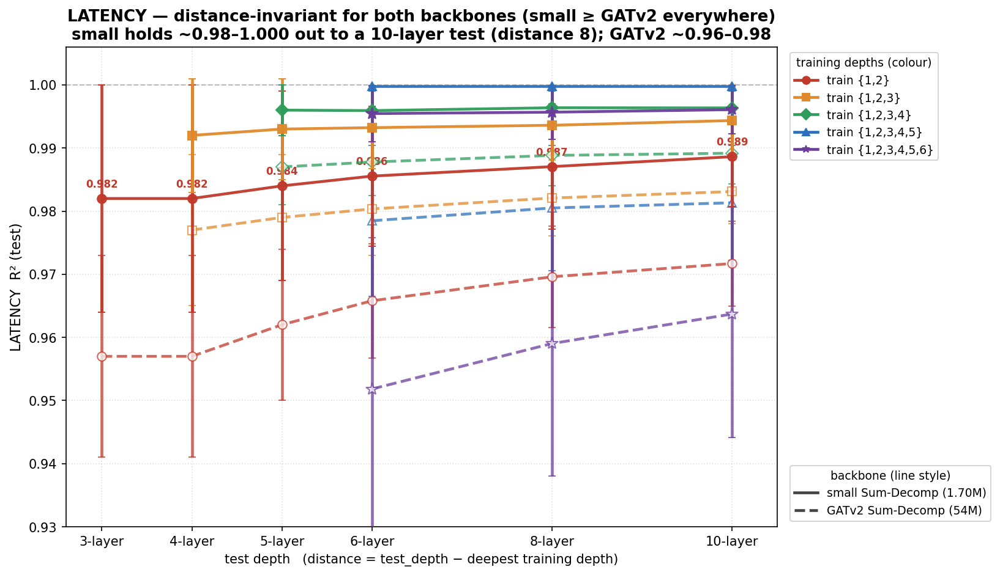

**LATENCY is distance-invariant.** Every training config sits at the top of the plot: train {1,2}
holds 0.982 → 0.989 from a 3-layer test all the way out to a **10-layer** test (distance 8), and with
≥3 training depths latency is a flat **1.000**. Depth distance costs latency essentially nothing.

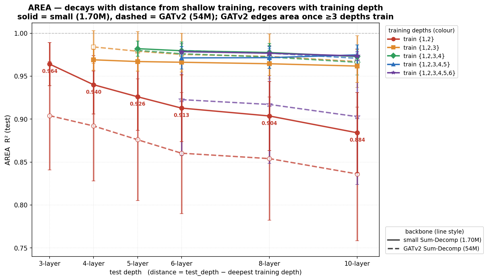

**AREA decays smoothly with distance, then recovers with training depth.** From shallow {1,2}-only
training, area falls 0.964 → 0.884 over distance 1→8 (≈0.01 R²/depth). But each extra depth in training
lifts the *whole* curve back toward 1.0 and flattens it: at the 10-layer test, area climbs 0.884 (train
≤2) → 0.962 (≤3) → 0.973 (≤4) → 0.975 (≤5). The full RF{1,4,8,16} sets remove the earlier RF{1,4}
6-layer artifact that had suggested a latency break at distance 4 — there is none. *(A combined
single-axis version is in `figures/extrap_ladder.png`.)*

### 6.2 Predicted-vs-true

All four seeds, no selection (rows = LATENCY/AREA, columns = seeds; R² computed on the full test set):

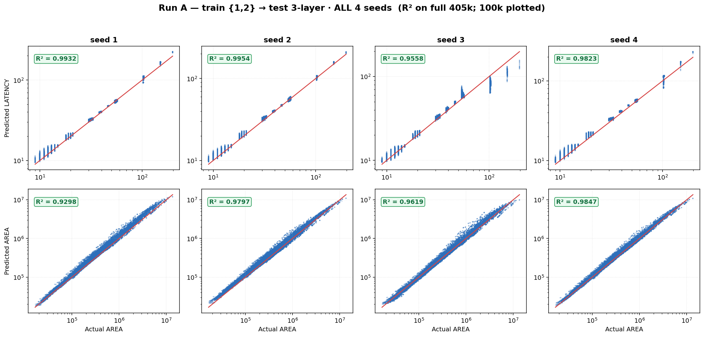
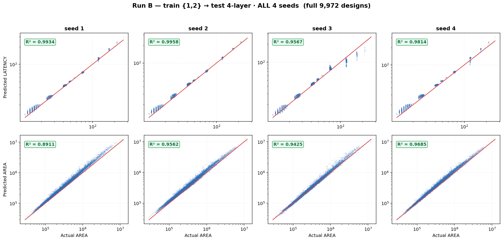

Best-test-seed detail (seed 2; includes the exact-LUT throughput panel) and Run C:

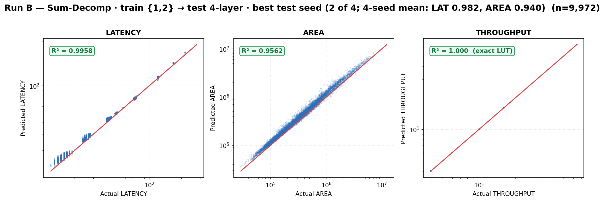
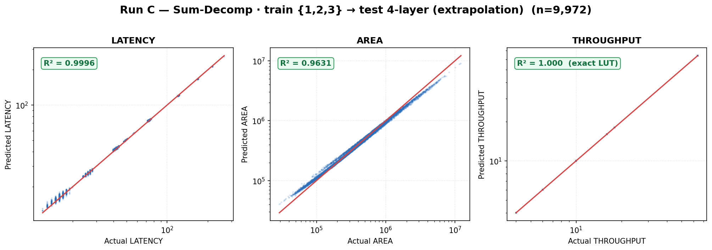

### 6.3 Beyond linear R² — what the errors feel like

Linear R² is dominated by the largest designs (area spans ~2.5 decades). In relative terms, shallow-
trained area error is **~8–14% per design** (SMAPE), with 34–73% of designs within ±10% depending on
seed, and a systematic over-prediction that grows with depth (median pred/actual: +2–10% at d3,
+4–13% at d4, +6–15% at d5). Latency: ~4% SMAPE, MAE ≈ 1–2 cycles at all depths. With depth-3 in
training (Run E), the depth-5 bias collapses (median ratios 0.985–1.056).
One selection caveat: the best-*validation* seed was the *worst* area extrapolator — shallow val loss
cannot rank extrapolation quality (use a deeper-than-train probe set for model selection).

### 6.4 The GATv2-SumDecomp (54M) matrix — full mirror, 4 seeds per row

`FPGA_GNN_GATv2_SumDecomp` (lui-gnn encoder 512/5-heads/residual + the same Σ-readout), uniform
recipe NAdam lr 1e-4, patience 40 (lr 3e-4 plateaus after warm-up on the big pools). Same splits,
same protocol (B/D and E reuse the A-g and C-g checkpoints via `eval_ckpt.py`):

| Run | Train→Test | **small (1.7M)** LAT / AREA | **GATv2 (54M)** LAT / AREA |
|---|---|---|---|
| A | {1,2}→3 | **0.982 ± 0.018** / **0.964 ± 0.025** | 0.957 ± 0.016 / 0.904 ± 0.063 |
| B | {1,2}→4 | **0.982 ± 0.018** / **0.940 ± 0.034** | 0.957 ± 0.016 / 0.892 ± 0.064 |
| D | {1,2}→5 | **0.984 ± 0.015** / **0.926 ± 0.039** | 0.962 ± 0.012 / 0.876 ± 0.071 |
| C | {1,2,3}→4 | **0.992 ± 0.009** / 0.969 ± 0.012 | 0.977 ± 0.012 / **0.984 ± 0.019** |
| E | {1,2,3}→5 | **0.993 ± 0.008** / 0.967 ± 0.011 | 0.979 ± 0.010 / **0.979 ± 0.023** |
| F | {1,2,3,4}→5 | **0.996 ± 0.004** / **0.982 ± 0.009** | 0.987 ± 0.006 / 0.980 ± 0.011 |

*(This 3/4/5-layer slice is the original matrix; the **full 6/8/10-layer extension for both backbones**
— Runs G–R, plus the new {1,2,3,4,5,6}-trained runs S/T — is the unified master table in §1. The
backbone verdict is unchanged and reinforced: shallow-trained the 54M model is worse on both metrics;
with ≥3 depths it ties/edges area but never wins latency; the small model dominates the deep tests.)*

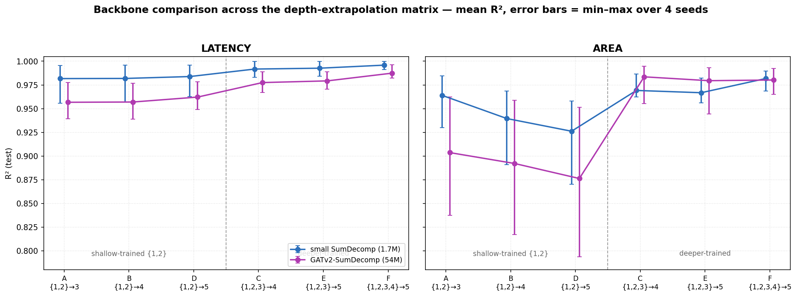

GATv2 all-seeds predicted-vs-true (shallow-trained rows, where it struggles most):

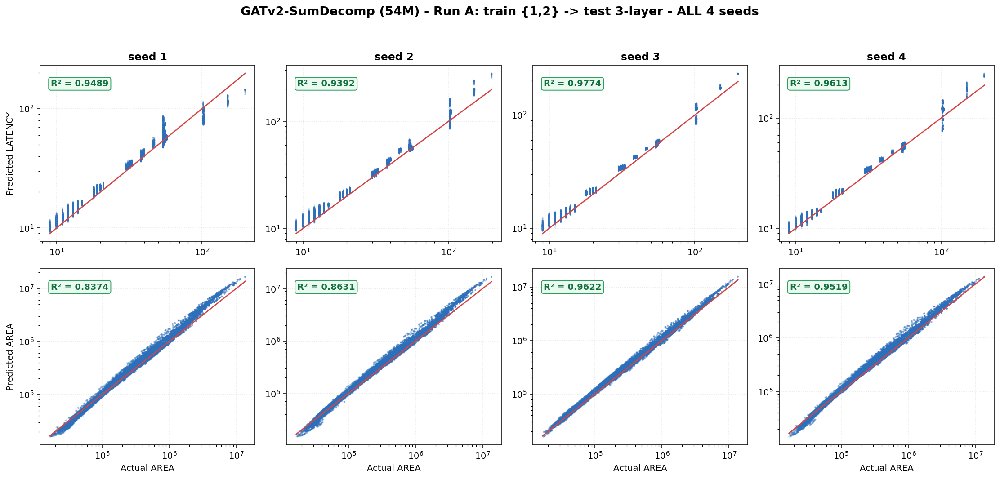
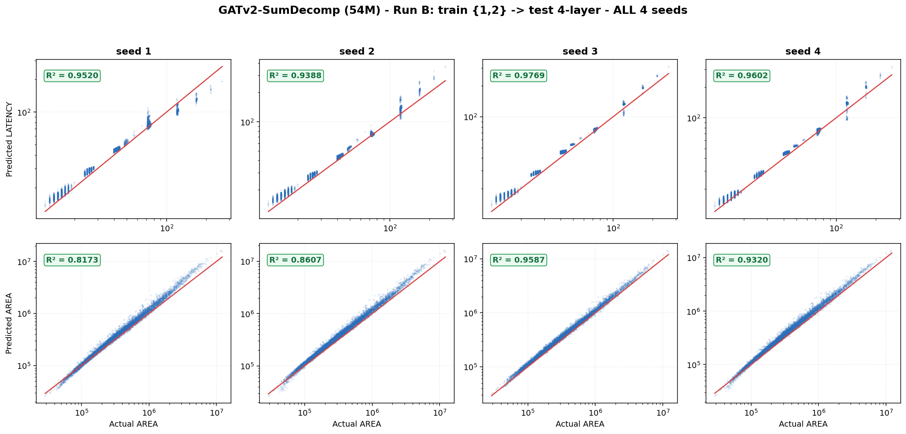

**Reading:**
- **Shallow-trained (A/B/D), the 54M model is strictly worse** — latency −0.02, area −0.05 to −0.06
  below the small model, with ~2× the seed variance (area swings down to 0.79). The big encoder
  over-fits the narrow {1,2} depth distribution; extra capacity *hurts* extrapolation.
- **With depth-3 in training (C/E), GATv2 takes the area crown** (0.984 / 0.979, best single run
  0.9948) while still conceding ~0.015 latency. If area at moderate extrapolation is the priority and
  ≥3 depths are available, the 54M backbone is the pick.
- **With depth-4 in training (F), the small model catches up on area (0.982 vs 0.980) while winning
  latency (0.996 vs 0.987)** — at 32× fewer parameters, the small SumDecomp remains the overall
  recommendation whenever the training pool spans ≥4 depths.
- lr sensitivity: the earlier NAdam 3e-4 attempt stalled (val flat from epoch 1, →4 area 0.9840);
  all numbers above use the converged lr 1e-4 recipe.

### 6.5 The pooling baseline — why the sum-decomposition readout exists (refreshed, 4 seeds)

The whole architecture rests on one claim: a **pool→MLP** readout (sum/mean/max-pool the node embeddings,
then an MLP predicts the total) **cannot extrapolate in depth**, because at test time it must output a total
magnitude outside its training range. The `exp→Σ` readout sidesteps this — a deeper design is just *one more
in-range term*. We now make that ablation rigorous: the **plain pooling `FPGA_GNN_GATv2` (54.47M, the published
lui-gnn)** retrained on the new catapult_v2 data with **4 seeds**, evaluated on the same held-out depths.

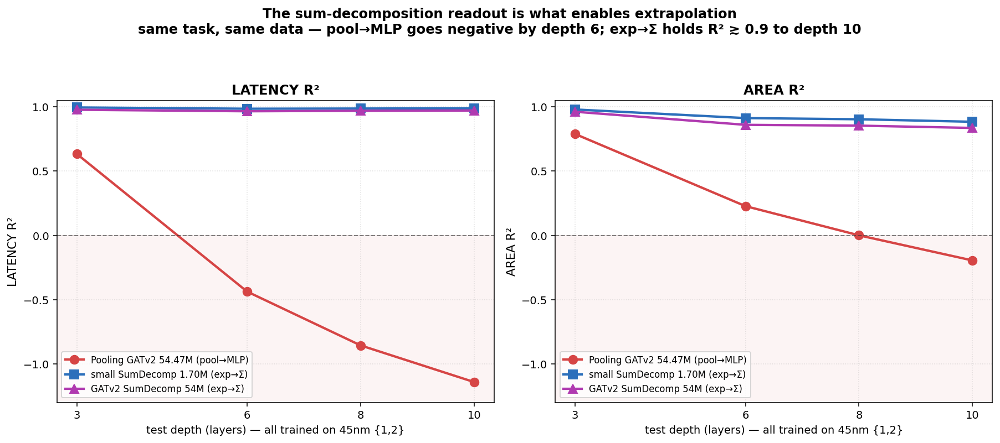

<table>
  <thead>
    <tr><th rowspan="2">Train→Test</th><th colspan="2">Pooling GATv2 54.47M<br>(pool→MLP)</th>
        <th colspan="2">small SumDecomp 1.70M<br>(exp→Σ)</th><th colspan="2">GATv2 SumDecomp 54M<br>(exp→Σ)</th></tr>
    <tr><th>LAT R²</th><th>AREA R²</th><th>LAT R²</th><th>AREA R²</th><th>LAT R²</th><th>AREA R²</th></tr>
  </thead>
  <tbody>
    <tr><td>{1,2} → 3L &nbsp;<i>(Run A regime)</i></td>
        <td>0.634 ± .008</td><td>0.789 ± .010</td>
        <td><b>0.995</b></td><td><b>0.980</b></td><td>0.977</td><td>0.962</td></tr>
    <tr><td>{1,2} → 6L</td><td>−0.448</td><td>0.239</td>
        <td><b>0.983</b></td><td><b>0.949</b></td><td>0.980</td><td>0.947</td></tr>
    <tr><td>{1,2} → 10L</td><td>−1.152</td><td>−0.181</td>
        <td><b>0.985</b></td><td>0.925</td><td>0.982</td><td><b>0.934</b></td></tr>
    <tr><td><b>{1,2,3} → 10L</b> &nbsp;<i>(Run N)</i></td>
        <td>−0.615 ± .033</td><td>0.273 ± .007</td>
        <td><b>1.000</b></td><td>0.974</td><td>0.989</td><td><b>0.992</b></td></tr>
  </tbody>
</table>

**Reading.**
- **The pooling model collapses exactly as predicted.** Trained on {1,2}, its latency R² goes **negative by
  the 6-layer test** (−0.45) and reaches **−1.15 at 10L** — worse than predicting the mean. Area follows
  (0.79 → −0.18). The refreshed {1,2}→3L numbers (**LAT 0.634 / AREA 0.789**, ±0.01 over 4 seeds) confirm the
  old single-seed ablation (0.69 / 0.73) with tight error bars.
- **More training depth only delays the collapse — it doesn't fix it.** Adding depth-3 to training (Run N,
  {1,2,3}→10L) lifts the pooling model off the floor (LAT −1.15 → −0.62, AREA −0.18 → 0.27) but it is **still
  far below zero on latency at distance 7**, while *both* SumDecomp models sit at **0.97–0.99** on the identical
  task. Same encoder, same 54M params for the GATv2 pair — **the readout is the entire difference.**
- This is the quantitative justification for §3's design choice and the gap referenced in §1.1.

## 7. Why does AREA decay while LATENCY stays flat? (mechanism, with evidence)

**1. The true targets differ in additivity.** Ground-truth mean area *per dense layer* falls with
depth — total area is **sub-additive** (shared control/interconnect amortizes; Catapult optimizes
across the pipeline):

| depth | 1 | 2 | 3 | 4 | 5 | 6 | 8 | 10 |
|---|---|---|---|---|---|---|---|---|
| true area/layer (µm²) | 204,231 | 177,093 | 168,040 | 135,070 | 133,863 | 130,880 | 129,533 | 128,538 |

The per-layer area keeps falling and **asymptotes near ~128k µm²** out to 10 layers — the overhead is
amortized once, early, then the marginal layer cost is nearly constant. This is exactly why AREA
decays *smoothly* (not a cliff) and why it is recoverable: the readout only needs to learn the
small, smooth depth-dependent correction, which one or two extra training depths supply.

Latency has no shared term — a layer's cycle count is (nearly) a pure function of its own
`(d_in,d_out,prec,rf)`, so design latency ≈ Σ per-layer *exactly* (throughput literally is a
per-layer lookup).

**2. The model's bias grows with depth exactly as the readout predicts.** Trained only on shallow
totals, the per-layer head absorbs the design overhead into every cᵢ (≈ overhead/n̄_train). Summing
n inflated terms over-shoots by ≈ (n/n̄_train − 1)·overhead — growing with n. Measured: the area
over-prediction climbs +2–10% → +4–13% → +6–15% across depths 3→5 and keeps growing out to the
10-layer test (distance 8) where train-{1,2} area falls to 0.884, while latency bias stays flat at
every distance — exactly the asymmetry the additive readout predicts.

**3. Confirmation:** giving the model depth-3 examples (Runs C/E) recalibrates the per-layer costs —
the depth-5 bias drops to ≈0 and R² recovers to 0.968 without ever seeing a 5-layer design.

So the additive readout isn't breaking — it is *faithfully compounding a small wrongness in the
additivity assumption for area*. That's also why this is fixable (see §10).

## 8. Interpretation

- **Q1 (distance):** target-dependent. Latency: distance-invariant (~0.98 at distances 1/2/3). Area:
  smooth ≈−0.02 R²/depth decay plus growing bias — no cliff, fully explained by §7.
- **Q2 (more depth):** yes, robustly. At test depth 5: train ≤2 → 0.926; ≤3 → 0.967; ≤4 → 0.979
  (area). Latency simultaneously rises 0.984 → 0.993 → 0.995. Both effects exceed seed noise, and
  deeper pools also shrink the seed spread ~3× (±0.011 vs ±0.039).
- **Practical guidance:** train on every depth you have; expect excellent latency and ~0.93–0.98 area
  depending on how far you extrapolate; for a brand-new depth, the dominant error is a predictable
  over-prediction bias — cheap to calibrate away (§10).

## 9. Caveats

- **Seed variance is the dominant uncertainty** (area spread up to ±0.05); we report seed means, and
  all runs final at 4 seeds. **All test sets are now the full 10,000-design RF{1,4,8,16} releases**
  (the earlier RF{1,4}-only 6-layer caveat is resolved — and it had materially mattered: on the
  RF{1,4} subset the small model's 6-layer latency read 0.904, vs **0.986** on the full set).
- 4/5-layer sets are **LHS samples** (sparse) vs the cartesian 1–3 grids; depth is the only changed
  axis but test coverage differs.
- 3-layer designs dominate the ≥3-depth training pools (~93%); class imbalance is noted, not corrected.
- An earlier checkpoint-collision bug (two jobs sharing one minute-stamped output dir) corrupted the
  first split_12 eval; fixed via `--run-tag`, all affected runs re-done cleanly, and all numbers
  re-verified from raw predictions.

## 10. Mitigations for the area bias (ranked)

1. **Per-layer supervised loss** — the report JSONs already contain the real per-layer breakdown
   (Giuseppe, 06-05). `L = MSE(total) + λ·MSE(per-layer cᵢ)` stops overhead absorption at the root and
   adds interpretability. Needs a converter extension.
2. **Explicit overhead head** — `total = Σ cᵢ + g(globals)`: ~10-line change; gives shared cost a
   depth-independent home.
3. **Feed `1/n_layers` to the per-layer head** — lets it represent `cᵢ = layer_cost + overhead/n`
   exactly; `1/n` shrinks with depth, so it extrapolates safely.
4. **Train on all available depths** — proven above (+0.04–0.05 area R² per added depth at d5).
5. **Post-hoc depth calibration** — 1 parameter on a ~100-design probe set; removes most of the bias
   with zero retraining.
6. **Bounded `corr` variant on ≥3-depth training** — the `(1+ε·tanh)` term finally has signal to learn
   the sub-additive discount.

Also queued: extrapolation-aware model selection (deeper-than-train probe set), EMA/SWA for variance,
22nm `gf22fdx/` finetuning, width extrapolation (`mlp-*-96+neuron`, when populated).

## 11. Reproducibility

```bash
sbatch slurm/prep_v2_arghya.sh                  # convert mlp-{1..4}layer + build split_12/split_123
python dataset/convert_parallel.py --archive <5L runs> --prefix L5 ...   # 5-layer (10k, 0 skipped)
python dataset/build_split_generic.py --train-groups 1 2 3 4 --test-groups 5 --out .../split_1234
# train (per seed): GNN/run_sumdecomp.py --variant plain --optimizer adamw --lr 1e-3 \
#     --base-dir $SCRATCH/catapult_v2/split_{12|123|1234} --drop-throughput --run-tag <tag>
# eval-only (Runs D/E): GNN/eval_ckpt.py --ckpt-dir <run>/best_model --variant plain \
#     --features $SCRATCH/catapult_v2/raw/L5_features.npy --labels .../L5_labels.npy
# figures: figures/draw_ladder.py · make_extrap_plots.py · make_loss_history.py
```

Jobs: prep 54316192 · A/B seeds 54327932, 54328066, 54328175, 54328176 · C 54316211, 54332630-32 ·
C-GATv2 54332878 (re-run 54334040) · F 54333203-05, 54333207. Checkpoints under
`GNN/gnn_results_plots/<run>/best_model/`; per-run E/D JSON in `GNN/eval_results/`.
Data: `$SCRATCH/catapult_v2/{raw, split_12, split_123, split_1234}`.

## 12. Backup — training history (all runs × seeds)

Loss vs epoch (normalized log-space MSE) parsed from the SLURM logs; one panel per run-seed, green dot
= best-val epoch (the saved checkpoint). Regenerate with `figures/make_loss_history.py`.

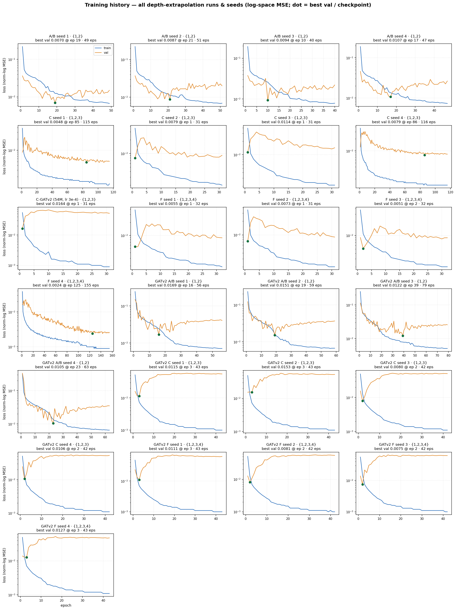

Notes: {1,2} runs train on ~24k designs → noisier val, early bests; ≥3-depth runs train on ~370k →
1,440+ steps/epoch, so "best at epoch 1–25" still means thousands of updates (their checkpoints test
fine — see §6). The C-GATv2 lr 3e-4 panel shows the val plateau that motivated the lr 1e-4 re-run.
