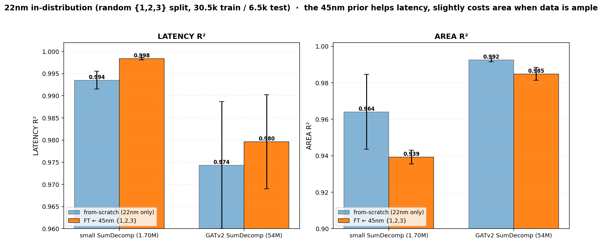

# Report — Readout Ablation (pooling vs sum-decomposition) & 22nm In-Distribution Control

**Author:** Arghya Ranjan Das · **Date:** 2026-06-15 · **Repo:** `wa_hls4ml_models @ Catapult-ASIC-dev`
**Targets:** `LATENCY` (cycles), `AREA` (µm²); `THROUGHPUT` is the exact LUT (R² = 1.000 everywhere, omitted).

---

## 0. What we were checking

Three questions, all answered with **4 seeds per cell** on the new catapult_v2 data (mean ± std):

1. **Readout ablation (refresh).** Does the *original* pooling GATv2 (`FPGA_GNN_GATv2`, 54.47M, pool→MLP —
   the published lui-gnn) actually collapse on depth extrapolation? This refreshes the stale single-seed
   row (`LAT 0.6935 / AREA 0.7314`) with proper statistics and a full depth ladder. **(§1)**
2. **Run N comparison.** Train on `{1,2,3}` layers, test on **10 layers** — the exact regime where we already
   have the two SumDecomp models. Add the pooling GATv2 as the third architecture to isolate *what the
   sum-decomposition readout buys*. **(§2)**
3. **22nm in-distribution control.** When you have *ample* in-distribution 22nm data, is the 45nm prior still
   worth fine-tuning from, or is training from scratch just as good? **(§3)**

**Metric key.** R² = 1.0 perfect · 0.0 = no better than predicting the mean · **< 0 = worse than the mean.**
SMAPE = symmetric mean abs. % error (lower better). MAE in raw units (cycles / µm²).

---

## 1. Readout ablation — pooling GATv2 collapses on depth extrapolation

**Setup.** Train `FPGA_GNN_GATv2` (54.47M, pool→MLP) on 45nm `{1,2}`-layer designs (24,480), test on held-out
deeper depths (full raw sets: L3 = 405k, L6/L8/L10 = 10k each). AdamW, lr 1e-3, 4 seeds.

<table>
  <thead>
    <tr><th rowspan="2">Train → Test</th><th colspan="3">LATENCY</th><th colspan="3">AREA</th></tr>
    <tr><th>R²</th><th>SMAPE</th><th>MAE (cyc)</th><th>R²</th><th>SMAPE</th><th>MAE (µm²)</th></tr>
  </thead>
  <tbody>
    <tr><td>{1,2} → <b>3L</b> &nbsp;<i>(the refresh)</i></td>
        <td><b>0.634 ± .008</b></td><td>38.99%</td><td>10.2</td>
        <td><b>0.789 ± .010</b></td><td>38.59%</td><td>178,519</td></tr>
    <tr><td>{1,2} → 6L</td>
        <td>−0.448 ± .022</td><td>98.43%</td><td>41.9</td>
        <td>0.239 ± .027</td><td>98.39%</td><td>526,218</td></tr>
    <tr><td>{1,2} → 8L</td>
        <td>−0.867 ± .022</td><td>118.6%</td><td>63.1</td>
        <td>0.013 ± .031</td><td>119.8%</td><td>785,512</td></tr>
    <tr><td>{1,2} → 10L</td>
        <td>−1.152 ± .021</td><td>132.2%</td><td>84.1</td>
        <td>−0.181 ± .032</td><td>134.3%</td><td>1,042,471</td></tr>
  </tbody>
</table>

**Refresh vs the old stale row:** `LAT 0.634 / AREA 0.789` (4 seeds, ±0.01) vs old `0.6935 / 0.7314` (1 seed).
The scale-free metrics agree; the larger AREA MAE is only because the test set is now the *full* 405k-design L3
(mean area 504k µm², range up to 13.6M), not a small subset — MAE scales with that, R²/SMAPE do not.

**Reading.** Latency goes **negative by the 6-layer test** (−0.45) and reaches **−1.15 at 10L** — the model is
literally worse than guessing the average. Area decays the same way (0.79 → −0.18). A pool→MLP readout must
emit a *total* magnitude; on a deeper-than-trained design that total is out of its learned range, so it
saturates and the prediction degrades monotonically with distance.

**The collapse is *only* in extrapolation — in-distribution the pooling models are excellent.** For contrast,
trained and tested on the *same* random `{1,2,3}` distribution (interpolation, 303,660 train / 65,070 test,
refreshed on catapult_v2, 4 seeds):

<table>
  <thead>
    <tr><th>Model (interpolation, random {1,2,3})</th><th>Params</th>
        <th>LAT R²</th><th>LAT SMAPE</th><th>AREA R²</th><th>AREA SMAPE</th></tr>
  </thead>
  <tbody>
    <tr><td>GraphSAGE (<code>FPGA_GNN</code>, add-pool→MLP)</td><td>0.59M</td>
        <td>0.9925 ± .007</td><td>2.78%</td><td>0.9919 ± .004</td><td>3.12%</td></tr>
    <tr><td>GATv2 lui-gnn (<code>FPGA_GNN_GATv2</code>, multi-pool→MLP)</td><td>54.47M</td>
        <td><b>0.9997 ± .000</b></td><td>0.96%</td><td><b>0.9991 ± .000</b></td><td>1.39%</td></tr>
  </tbody>
</table>

So the pooling readout is **not broken in general** — the lui-gnn is the best *interpolation* model (0.9997 /
0.9991). It fails *specifically* on depth extrapolation, where the total magnitude leaves the training range.
That is the precise gap the sum-decomposition readout closes (§2).

---

## 2. Run N — same task, three architectures: the readout is the whole difference

**Setup.** Train on 45nm `{1,2,3}`, test on **10 layers** (distance 7). Pooling GATv2 trained 4 seeds (this
work); the two SumDecomp models are the existing Run N rows from `REPORT_depth_extrap_1to5.md` §1.

<table>
  <thead>
    <tr><th rowspan="2">Model (readout)</th><th>Params</th><th colspan="2">LATENCY</th><th colspan="2">AREA</th></tr>
    <tr><th></th><th>R²</th><th>SMAPE</th><th>R²</th><th>SMAPE</th></tr>
  </thead>
  <tbody>
    <tr><td><b>Pooling GATv2</b> (pool→MLP)</td><td>54.47M</td>
        <td><b>−0.615 ± .033</b></td><td>106.5%</td>
        <td><b>0.273 ± .007</b></td><td>97.84%</td></tr>
    <tr><td>small SumDecomp (exp→Σ)</td><td>1.70M</td>
        <td><b>1.000</b></td><td>1.1%</td><td>0.974</td><td>7.0%</td></tr>
    <tr><td>GATv2 SumDecomp (exp→Σ)</td><td>54M</td>
        <td>0.989</td><td>8.0%</td><td><b>0.992</b></td><td>10.0%</td></tr>
  </tbody>
</table>

**Reading.** Even *with* depth-3 in training, the pooling model still fails at the 10-layer test
(LAT **−0.615**, AREA 0.273), while both SumDecomp models sit at **0.97–1.00**. The GATv2 SumDecomp shares the
**identical 54M encoder** with the pooling GATv2 — the *only* change is the readout (`exp→Σ` vs `pool→MLP`).
So this is not a capacity effect: **the sum-decomposition readout, not model size, is what enables extrapolation.**

For context, more training depth *delays* the pooling collapse but never fixes it — its 10-layer latency R²
improves from −1.15 (trained on `{1,2}`) to −0.62 (trained on `{1,2,3}`), still far below zero.

*Trained on {1,2}, tested at depths 3/6/8/10: the pooling GATv2 (red) dives into the negative-R² zone by
6 layers; both SumDecomp models (blue/magenta) hold R² ≳ 0.9 (latency near 1.0) all the way to 10 layers.*

---

## 3. 22nm in-distribution control — is the 45nm prior still needed with ample data?

**Setup.** `rand123` = random **70/15/15** split of *all* 22nm `{1,2,3}`-layer designs (43,602 → 30,522 train /
6,540 val / 6,540 test; depth mix preserved). Compare **from-scratch** vs **full fine-tune from the 45nm
`{1,2,3}` checkpoint**, both backbones, 4 seeds.

<table>
  <thead>
    <tr><th rowspan="2">Backbone</th><th rowspan="2">Condition</th><th colspan="3">LATENCY</th><th colspan="3">AREA</th></tr>
    <tr><th>R²</th><th>SMAPE</th><th>MAE (cyc)</th><th>R²</th><th>SMAPE</th><th>MAE (µm²)</th></tr>
  </thead>
  <tbody>
    <tr><td rowspan="2"><b>small SumDecomp</b> 1.70M</td>
        <td>from-scratch</td>
        <td>0.9935 ± .002</td><td>3.85%</td><td>0.89</td>
        <td><b>0.9641 ± .020</b></td><td>4.98%</td><td>4,933</td></tr>
    <tr><td>FT ← 45nm {1,2,3}</td>
        <td><b>0.9984 ± .000</b></td><td>2.68%</td><td>0.54</td>
        <td>0.9393 ± .004</td><td>8.41%</td><td>7,869</td></tr>
    <tr><td rowspan="2"><b>GATv2 SumDecomp</b> 54M</td>
        <td>from-scratch</td>
        <td>0.9743 ± .014</td><td>4.44%</td><td>1.27</td>
        <td><b>0.9925 ± .001</b></td><td>5.26%</td><td>3,761</td></tr>
    <tr><td>FT ← 45nm {1,2,3}</td>
        <td><b>0.9796 ± .011</b></td><td>8.10%</td><td>1.69</td>
        <td>0.9849 ± .003</td><td>5.14%</td><td>4,447</td></tr>
  </tbody>
</table>

**Reading.**
- **Everything is excellent** (R² 0.94–0.99) — with 30k in-distribution designs there is no extrapolation gap.
- **The prior helps *latency*, slightly costs *area*.** Latency is node-independent (cycle counts) so the 45nm
  prior transfers free → a head start (small **0.9935 → 0.9984**, SMAPE 3.85% → 2.68%). Area is node-specific,
  so a model carrying the 45nm scale must *unlearn* it; with ample data, from-scratch fits area cleaner
  (GATv2 area **0.9925** scratch vs 0.9849 FT; small area 0.9641 vs 0.9393).
- **Backbone split:** small owns latency (0.998), the 54M GATv2 owns area (0.992).

**Bounds when transfer matters.** Combined with the cross-node transfer study (`REPORT_transfer_22nm.md` §5):
the 45nm prior is **essential at low data / extrapolation** (from-scratch fails below ~500 designs there) and
**optional — even mildly area-counterproductive — in-distribution with thousands of designs.** Rule of thumb:
*fine-tune when 22nm data is scarce or you need an uncharacterized depth; train from scratch when you already
have thousands of in-distribution 22nm designs.*

---

## 4. Headline numbers (one place)

| what | result |
|---|---|
| **Pooling GATv2 refresh**, {1,2}→3L | LAT **0.634**, AREA **0.789** (was 0.6935 / 0.7314, 1 seed) |
| Pooling GATv2, {1,2}→6L | **negative latency R²** (−0.448) — collapse begins one ladder rung out |
| **Run N**, {1,2,3}→10L: pooling vs SumDecomp | LAT **−0.615** vs **0.99–1.00**; AREA 0.273 vs **0.97–0.99** |
| **22nm in-dist**: FT vs scratch | FT wins latency (+0.005), scratch wins area (+0.008); both 0.94–0.99 |

## 5. Reproduce

| step | command / location |
|---|---|
| 22nm in-dist split | `dataset/build_22nm_rand123.py` → `$SCRATCH/catapult_22nm/rand123/` |
| pooling-GATv2 train+eval | `slurm/submit_poolgat.sh` (→ `train_poolgat_one.sh`) |
| pooling-GATv2 eval-only | `slurm/eval_poolgat_train123.sh` (re-eval saved checkpoints) |
| 22nm in-dist train+eval | `slurm/submit_22nm_rand123.sh` |
| aggregate | `figures/aggregate_poolgat.py`, `figures/aggregate_rand123.py` |
| figures | `figures/make_pooling_vs_sumdecomp.py`, `figures/make_rand123_bars.py` |
| eval engine | `GNN/eval_ckpt.py --variant poolgat` (verified identical to `run_gnn.py --eval-only`: MAE 0.2415 cyc / 6324 µm², R² 0.9997) |

*Pooling-GATv2 eval results: `$SCRATCH/catapult_v2/eval_results/poolgat__*.json`.
22nm in-dist: `$SCRATCH/catapult_22nm/eval_results_rand123/*.json`. All numbers 4 seeds, mean ± std.*
