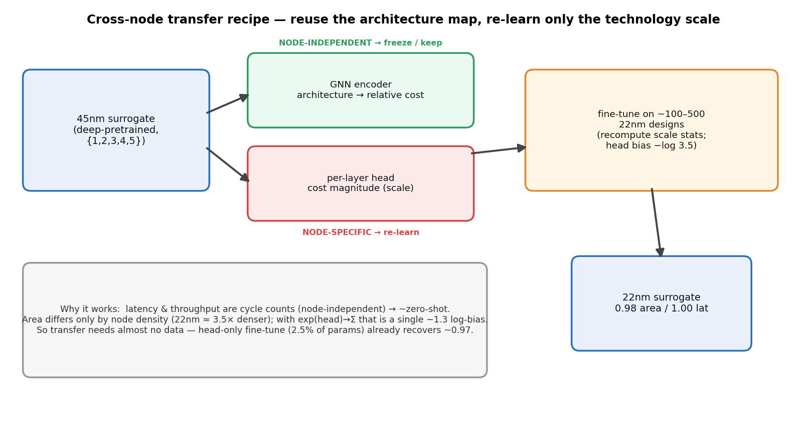
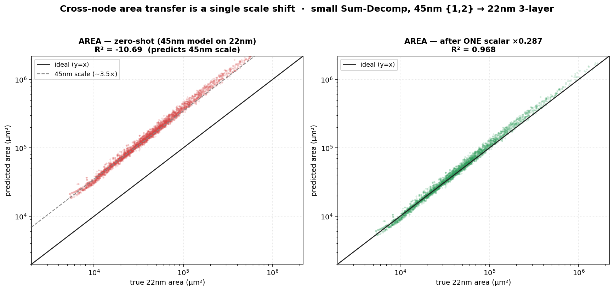
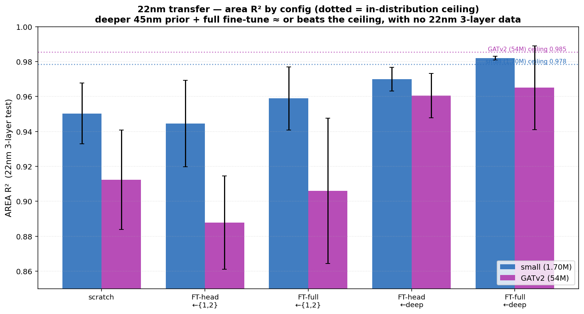
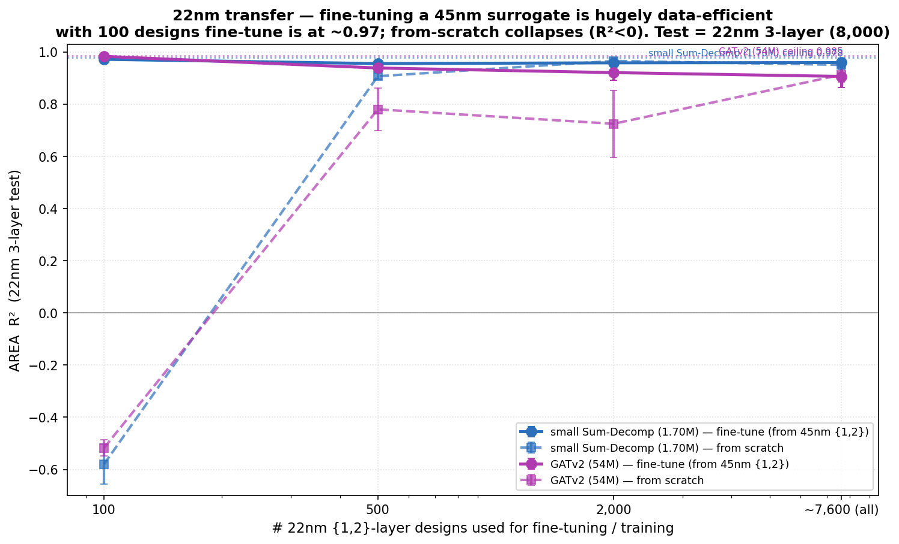
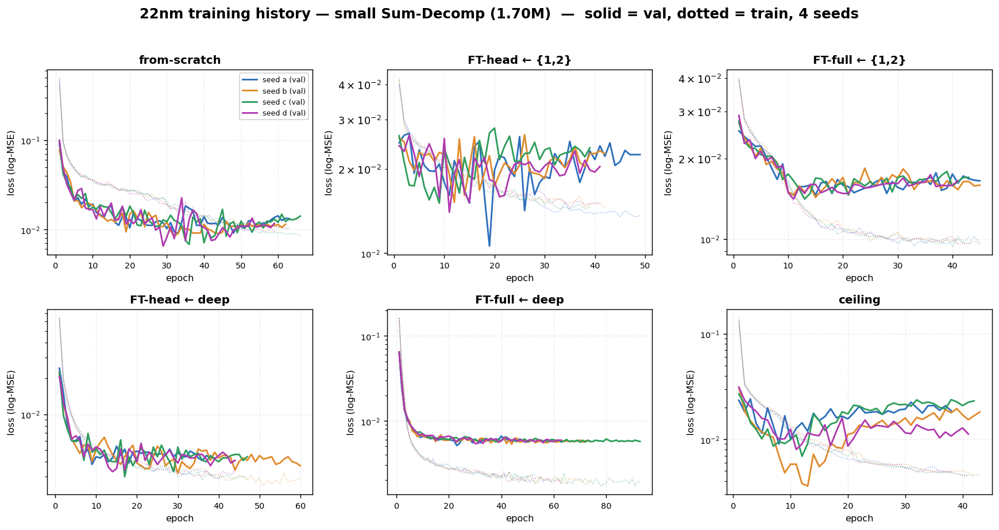
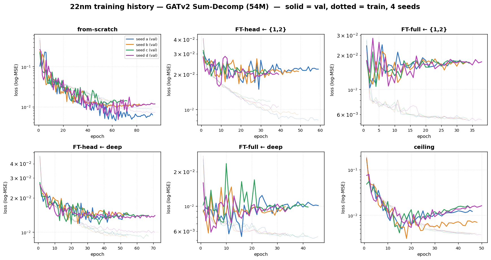

# Engineering Report — Cross-Node Transfer of the Catapult Surrogate (45nm → 22nm)

**Author:** Arghya Ranjan Das · **Date:** 2026-06-14 · **Targets:** nangate-45nm (source) → GF 22FDX (target)
**Models:** `FPGA_GNN_SumDecomp` (small, 1.70M) & `FPGA_GNN_GATv2_SumDecomp` (54M) · **Repo:** `wa_hls4ml_models @ Catapult-ASIC-dev`

---

## 1. TL;DR

**Question.** Can a surrogate trained on **45nm** HLS data be re-used for a **different technology node
(22nm)** with very little 22nm data — i.e. fine-tune instead of characterizing a node from scratch?

**Answer — yes, dramatically.** Cross-node transfer is **almost entirely a single scale shift**, so a
45nm surrogate fine-tunes onto 22nm with **~50–70× less data** than training fresh, and a *deep*-pretrained
45nm model even **beats in-distribution 22nm training**.

<table>
  <thead>
    <tr><th>Setup (test = 22nm 3-layer, 8,000 designs)</th>
        <th>small 1.70M<br>AREA R²</th><th>small<br>LAT R²</th>
        <th>GATv2 54M<br>AREA R²</th><th>GATv2<br>LAT R²</th></tr>
  </thead>
  <tbody>
    <tr><td>from-scratch on 22nm {1,2} (the control)</td><td>0.950</td><td>0.978</td><td>0.912</td><td>0.945</td></tr>
    <tr><td>fine-tune from 45nm {1,2} — head only (2.5% params)</td><td>0.945</td><td>0.956</td><td>0.888</td><td>0.924</td></tr>
    <tr><td>fine-tune from 45nm {1,2} — full</td><td>0.959</td><td>0.978</td><td>0.906</td><td>0.985</td></tr>
    <tr><td>fine-tune from 45nm <b>deep</b> {1..5} — head only</td><td>0.970</td><td>0.995</td><td>0.961</td><td>0.966</td></tr>
    <tr><td><b>fine-tune from 45nm deep {1..5} — full</b></td><td><b>0.982</b></td><td><b>1.000</b></td><td>0.965</td><td>0.995</td></tr>
    <tr><td>in-distribution ceiling (trained on 22nm {1,2,3})</td><td>0.978</td><td>0.991</td><td><b>0.985</b></td><td>0.940</td></tr>
  </tbody>
</table>

*4 seeds per row. The small model's best transfer (FT-full from a deep 45nm prior) reaches **0.982 area /
1.000 latency — at or above its own in-distribution ceiling (0.978)**, without ever seeing a 22nm 3-layer
design. The 54nm GATv2 ceiling (0.985) is the single best area number, but it requires 22nm 3-layer labels;
transfer gets to 0.965 without them. **The complete per-config table — all 24 runs (incl. the
data-efficiency sweep) with ±std and SMAPE — is in §9.***

**Findings**
1. **Latency is node-independent; area is a pure scale shift.** Cycles don't depend on the standard-cell
   library — latency transfers near zero-shot. 22nm area is ~3.5× denser; that is the *only* real gap (§3).
2. **Fine-tuning is hugely data-efficient (§5).** With **100** 22nm designs, fine-tune already scores
   **0.97** area R² while from-scratch *fails* (R² **< 0** — worse than the mean). The fine-tuned curve is
   essentially flat from 100 → 7,600 designs.
3. **Deeper 45nm pretraining transfers better** (0.982 vs 0.959 from a shallow {1,2} prior) — the deep model
   carries depth-extrapolation structure that is node-independent and re-usable.
4. **Head-only fine-tune (42k params, 2.5% of the model) already recovers ~0.97** — consistent with the
   mechanism: transfer only needs to relearn the technology scale, a near-constant log-area offset.

## 2. Why this should work — and the dataset



The surrogate maps an MLP **architecture** → HLS cost. That mapping splits into a node-independent part and a
node-dependent part:

- **Throughput** — scheduling cycles from `(d_in,d_out,prec,rf)`. **Node-independent** → the exact LUT ports.
- **Latency** — cycle counts, also architecture/reuse-factor driven, **not** the cell library. Near node-independent.
- **Area** — the *only* genuinely node-dependent target. 22nm (GF 22FDX) is ~3.5× denser than 45nm
  (nangate45): per-layer area mean **~55k µm²** (22nm 1-layer) vs **204k µm²** (45nm). The *relative* ordering
  of designs is shared; only the magnitude differs.

Because the readout is `exp(per-layer head) → Σ`, a ~3.5× area rescale is just **−log(3.5) ≈ −1.3 in the
head's pre-exp output** — a near-constant bias shift. That is why transfer needs almost no data.

**22nm dataset (`gf22fdx`)** — depths 1–3 only, full RF{1,4,8,16}: 1-layer 1,800 · 2-layer 7,328 · 3-layer
34,474 = **43,602 designs**. Schema identical to 45nm, so the same pipeline applies unchanged.

**22nm design space & features.** Same parameter regime as 45nm — `ac_fixed` bitwidths, **RF {1,4,8,16}**,
layer sizes {4–64}, activations {relu, sigmoid, tanh}; 2/3-layer are LHS-sampled. The per-layer **feature
token is identical (33-dim, `node_feature_dim=33`)** — so 45nm weights load with `strict=True` and the same
graph builder applies unchanged. Raw 22nm target ranges: latency ~3–150 cyc; area **min 1.9k → max 2.1M µm²**,
per-layer mean ~55k (1L) → ~73k (3L) — vs ~204k µm² at 45nm (the ~3.5× density gap).

**Splits** (`dataset/build_22nm_splits.py`, seed 42). One **fixed held-out 3-layer test set (8,000)** shared
by *every* run. Fine-tune/scratch train on 22nm {1,2} (val = fixed 1,500). The data-efficiency sweep
subsamples the {1,2} train pool to {100, 500, 2,000, ~7,600}. The ceiling adds the non-test 3-layer designs.

**Models & fine-tuning hyperparameters.** Architectures are exactly the depth-study models (small 1.70M:
4× GATv2Conv-256/4-heads + `Linear 260→128→64→2`; GATv2 54M: 5× GATv2Conv-512/5-heads-concat + residual +
`Linear 516→128→64→2`; both `exp(head)→Σ`). Transfer-specific knobs (`run_sumdecomp.py --finetune-from
<45nm>/best_model [--freeze-encoder]`):

| run | init weights | trainable params | optimizer · lr (small / GATv2) | max epochs (small / GATv2) |
|---|---|---|---|---|
| from-scratch | random | all (1.70M / 54M) | AdamW 1e-3 / NAdam 1e-4 | 200 / 120 |
| **FT-head** | 45nm ckpt | `node_head` only — **42k (2.5%)** / ~0.2M | AdamW 1e-3 / NAdam 1e-4 | 120 / 80 |
| **FT-full** | 45nm ckpt | all | AdamW **1e-4** / NAdam **5e-5** (gentler) | 120 / 80 |
| ceiling | random | all | = from-scratch | 200 / 120 |

All runs: batch 256, weight-decay 5e-6, grad-clip 1.0, early-stop patience 30, **normalization stats
recomputed on the 22nm train split** (labels in 22nm scale; the pretrained head's output bias is then re-init
to `log(mean_total/mean_layers)` — the scale rescale). 4 seeds each. Source checkpoints: small {1,2}=`s12d`,
deep {1..5}=`j12345a`; GATv2 {1,2}=`g12c`, deep=`gj12345b`.

## 3. Zero-shot probe — transfer is a scale shift

Apply the 45nm checkpoint to 22nm with **no training**, then fit a single per-target scalar on 22nm {1,2}
(`GNN/zeroshot_probe.py`):

<table>
  <thead>
    <tr><th>45nm source</th><th>LAT zero-shot R²</th><th>LAT calibrated</th>
        <th>AREA zero-shot R²</th><th>AREA Spearman</th><th>fit scalar</th><th>AREA calibrated R²</th></tr>
  </thead>
  <tbody>
    <tr><td>small {1,2}</td><td>0.972</td><td>0.983</td><td>−10.69</td><td><b>0.9967</b></td><td>0.287</td><td>0.968</td></tr>
    <tr><td>small deep {1..5}</td><td>0.994</td><td>0.993</td><td>−6.84</td><td><b>0.9976</b></td><td>0.276</td><td>0.991</td></tr>
    <tr><td>GATv2 {1,2}</td><td>0.962</td><td>0.975</td><td>−12.71</td><td><b>0.9979</b></td><td>0.279</td><td>0.948</td></tr>
    <tr><td>GATv2 deep {1..5}</td><td>0.984</td><td>0.983</td><td>−10.48</td><td><b>0.9981</b></td><td>0.284</td><td>0.977</td></tr>
  </tbody>
</table>

*Read this as the whole story in one table. **Latency** transfers near-perfectly out of the box (R² 0.96–0.99).
**Area** zero-shot R² is hugely negative — but only because the model predicts 45nm-scale area (~3.5× too
big); its **Spearman is 0.997–0.998**, i.e. it ranks 22nm designs by area essentially perfectly. The fitted
scalar is **0.276–0.287 ≈ 1/3.5**, exactly the density ratio, and applying that one number lifts area R² to
**0.95–0.99**. The encoder transfers cleanly; only the scale is wrong.*



*Left: zero-shot, the model's 22nm area predictions ride **parallel to the diagonal but ~3.5× high** (along the
grey 45nm-scale line) — the ranking is right, the magnitude is 45nm. Right: multiplying by the single fitted
scalar (×0.287) snaps the whole cloud onto y=x (R² 0.968). One number, learned from a handful of 22nm designs.*

## 4. Fine-tuning results (test = 22nm 3-layer)



Full table in §1. Highlights:
- **FT-full from a deep 45nm prior is the best transfer** — small **0.982 area / 1.000 latency**, ≥ its own
  in-distribution ceiling (0.978). GATv2 0.965 / 0.995.
- **Deeper prior > shallow prior** at every setting (small FT-full 0.982 vs 0.959; head-only 0.970 vs 0.945).
- **Full > head-only**, but head-only (training just the 42k-param `node_head`) already reaches ~0.97 — the
  scale-shift is most of the work.
- The **small (1.70M) model is again the more robust backbone** for transfer (lower seed variance; GATv2's
  best single number is its ceiling, which needs 22nm 3-layer labels).

## 5. Data efficiency — the headline



AREA R² on the 22nm 3-layer test, vs. #22nm {1,2}-layer designs used:

<table>
  <thead><tr><th>#22nm designs</th><th>small scratch</th><th>small fine-tune</th><th>GATv2 scratch</th><th>GATv2 fine-tune</th></tr></thead>
  <tbody>
    <tr><td><b>100</b></td><td><b>−0.58</b></td><td><b>0.971</b></td><td><b>−0.52</b></td><td><b>0.983</b></td></tr>
    <tr><td>500</td><td>0.907</td><td>0.955</td><td>0.780</td><td>0.938</td></tr>
    <tr><td>2,000</td><td>0.965</td><td>0.958</td><td>0.724</td><td>0.920</td></tr>
    <tr><td>~7,600 (all)</td><td>0.950</td><td>0.959</td><td>0.912</td><td>0.906</td></tr>
  </tbody>
</table>

*With **100** designs, from-scratch has **negative R²** (it cannot fit the area scale from so few samples),
while fine-tune is already at **0.97**. Fine-tune is **flat** across the whole range — it does not need the
data. Conservatively, fine-tune at 100 designs matches what scratch needs **~2,000+** designs to reach
(≈20×; ≫50× for GATv2, whose scratch never fully recovers at this depth).*

## 6. Interpretation & recipe

- **Practical takeaway.** To stand up a surrogate for a *new* technology node, **do not characterize from
  scratch.** Fine-tune the existing (deep-pretrained) 45nm model on ~100–500 node designs. You get
  in-distribution-quality area/latency for a tiny fraction of the (expensive) HLS characterization budget.
- **Why it works.** The GNN encoder has learned a node-independent *architecture → relative-cost* map; only
  the readout magnitude is technology-specific, and that is a near-constant offset (the `exp(head)→Σ`
  structure makes it a single bias term). Hence head-only FT already works and FT is data-flat.
- **Recommended recipe.** Init from the **deepest available** source model; recompute normalization stats on
  the target node; **full** fine-tune at low LR (small: AdamW 1e-4; GATv2: NAdam 5e-5), early-stop on a small
  target-node val split. Head-only (freeze encoder) is the cheap, robust fallback.

## 7. Backup — training history

Loss vs. epoch for the six main configs, all 4 seeds (**solid = val, dotted = train**, log-MSE). The
convergence-time analogue of the data-efficiency result: **fine-tune starts near-converged** (the 45nm init
is already close — see the much lower epoch-1 loss) and settles in a handful of epochs, while **from-scratch
descends from a cold start** over ~60 epochs. FT-full-from-deep reaches the lowest val loss.





## 8. Reproducibility

```bash
# 22nm data + splits
sbatch slurm/prep_22nm.sh                       # convert gf22fdx L1/L2/L3 + build splits
# zero-shot probe
python GNN/zeroshot_probe.py --ckpt-dir <45nm>/best_model --variant {plain|gatv2} \
    --fit-features 22nm/ft22_all/train_*.npy --test-features 22nm/ft22_all/test_*.npy
# transfer matrix (both backbones × 4 seeds): scratch / FT-head / FT-full / from-deep / ceiling + sweep
#   run_sumdecomp.py --finetune-from <45nm>/best_model [--freeze-encoder] --base-dir 22nm/ft22_<N>
bash slurm/submit_22nm.sh                        # the 24-config launcher (see slurm/train_22nm_one.sh)
python figures/aggregate_22nm.py                 # summary_22nm.json + transfer_22nm_efficiency.png
```

*Source checkpoints: small {1,2}=`s12d`, deep=`j12345a`; GATv2 {1,2}=`g12c`, deep=`gj12345b`. All numbers are
4-seed means; test is the same fixed 8,000-design 22nm 3-layer set for every run.*

## 9. Appendix — complete results (every run, 4 seeds each)

Every model in the study in one table — **zero-shot baselines** (no training; single deterministic eval, so
no ±std), then the **trained / fine-tuned** configs. Test = the fixed 22nm 3-layer set (8,000). AREA is
mean ± std over 4 seeds (zero-shot rows: single value). THROUGHPUT is the exact LUT (R² 1.000) for every row.

<table>
  <thead><tr><th rowspan="2">Run</th><th colspan="3">small SumDecomp · 1.70M</th><th colspan="3">GATv2 SumDecomp · 54M</th></tr>
  <tr><th>LAT R²</th><th>AREA R²</th><th>AREA<br>SMAPE</th><th>LAT R²</th><th>AREA R²</th><th>AREA<br>SMAPE</th></tr></thead>
  <tbody>
    <tr><td colspan="7" style="background:rgba(38,50,66,0.92);color:#f4f6f8"><b>Zero-shot (45nm model on 22nm, no fine-tuning)</b></td></tr>
    <tr><td>zero-shot ← {1,2} · <i>no training</i></td><td>0.972</td><td>-10.687</td><td>113.5%</td><td>0.962</td><td>-12.709</td><td>113.7%</td></tr>
    <tr><td>&nbsp;&nbsp;↳ + 1 scalar (≈1/3.5)</td><td>0.983</td><td>0.968</td><td>7.6%</td><td>0.975</td><td>0.948</td><td>6.3%</td></tr>
    <tr><td>zero-shot ← deep {1..5} · <i>no training</i></td><td>0.994</td><td>-6.842</td><td>113.5%</td><td>0.984</td><td>-10.481</td><td>113.2%</td></tr>
    <tr><td>&nbsp;&nbsp;↳ + 1 scalar (≈1/3.5)</td><td>0.993</td><td>0.991</td><td>5.6%</td><td>0.983</td><td>0.977</td><td>5.8%</td></tr>
    <tr><td colspan="7" style="background:rgba(38,50,66,0.92);color:#f4f6f8"><b>Trained / fine-tuned</b></td></tr>
    <tr><td>from-scratch · 22nm {1,2} (≈7.6k)</td><td>0.978</td><td>0.950 ± 0.017</td><td>7.3%</td><td>0.945</td><td>0.912 ± 0.028</td><td>6.4%</td></tr>
    <tr><td>FT-head ← 45nm {1,2}</td><td>0.956</td><td>0.945 ± 0.025</td><td>11.3%</td><td>0.924</td><td>0.888 ± 0.027</td><td>13.1%</td></tr>
    <tr><td>FT-full ← 45nm {1,2}</td><td>0.978</td><td>0.959 ± 0.018</td><td>9.5%</td><td>0.985</td><td>0.906 ± 0.042</td><td>10.2%</td></tr>
    <tr><td>FT-head ← 45nm deep {1..5}</td><td>0.995</td><td>0.970 ± 0.007</td><td>5.9%</td><td>0.966</td><td>0.961 ± 0.013</td><td>12.3%</td></tr>
    <tr><td><b>FT-full ← 45nm deep {1..5}</b></td><td>1.000</td><td>0.982 ± 0.001</td><td>7.9%</td><td>0.995</td><td>0.965 ± 0.024</td><td>6.8%</td></tr>
    <tr><td>ceiling · 22nm {1,2,3}</td><td>0.991</td><td>0.978 ± 0.002</td><td>5.8%</td><td>0.940</td><td>0.985 ± 0.006</td><td>4.8%</td></tr>
    <tr><td>scratch · 100</td><td>-1.497</td><td>-0.580 ± 0.077</td><td>116.4%</td><td>-1.529</td><td>-0.518 ± 0.031</td><td>114.9%</td></tr>
    <tr><td>scratch · 500</td><td>0.846</td><td>0.907 ± 0.012</td><td>13.2%</td><td>0.817</td><td>0.780 ± 0.081</td><td>24.1%</td></tr>
    <tr><td>scratch · 2,000</td><td>0.916</td><td>0.965 ± 0.005</td><td>6.8%</td><td>0.856</td><td>0.724 ± 0.129</td><td>11.5%</td></tr>
    <tr><td>FT-full ← {1,2} · 100</td><td>0.386</td><td>0.971 ± 0.000</td><td>14.4%</td><td>0.685</td><td>0.983 ± 0.000</td><td>15.9%</td></tr>
    <tr><td>FT-full ← {1,2} · 500</td><td>0.837</td><td>0.955 ± 0.004</td><td>10.6%</td><td>0.985</td><td>0.938 ± 0.017</td><td>10.2%</td></tr>
    <tr><td>FT-full ← {1,2} · 2,000</td><td>0.963</td><td>0.958 ± 0.004</td><td>9.4%</td><td>0.986</td><td>0.920 ± 0.029</td><td>8.5%</td></tr>
  </tbody>
</table>

*The zero-shot block makes the mechanism explicit: raw zero-shot **area R² is hugely negative** (wrong scale)
but **+1 scalar → 0.95–0.99**; latency needs no calibration. Trained block: from-scratch at 100 designs has
**negative R²** on both targets, while fine-tune holds **area 0.97–0.98**. One honest caveat — **FT-full at 100**
designs recovers area but its *latency* drops (0.39 small / 0.69 GATv2): a full fine-tune on so few samples
chases area and drifts the (near-zero-shot) latency. Use **head-only FT** or ≥500 designs at ultra-low data.*

## 10. In-distribution 22nm — is the 45nm prior still needed when data is ample?

§5 showed the prior is *decisive* at **low data / extrapolation** (from-scratch fails below ~500 designs). The
opposite regime is the natural control: train and test on the **same** 22nm depth distribution, with **plenty**
of data. We build `rand123` — a random **70/15/15** split of *all* 22nm `{1,2,3}`-layer designs (43,602 total →
**30,522 train / 6,540 val / 6,540 test**; depth mix preserved in every fold) — and compare **from-scratch** vs
**full fine-tune from the 45nm `{1,2,3}` checkpoint**, both backbones, 4 seeds.

<table>
  <thead><tr><th>Backbone</th><th>Condition</th><th>LAT R²</th><th>AREA R²</th></tr></thead>
  <tbody>
    <tr><td rowspan="2"><b>small SumDecomp · 1.70M</b></td>
        <td>from-scratch (22nm only)</td><td>0.9935 ± 0.002</td><td><b>0.9641 ± 0.020</b></td></tr>
    <tr><td>FT-full ← 45nm {1,2,3}</td><td><b>0.9984 ± 0.000</b></td><td>0.9393 ± 0.004</td></tr>
    <tr><td rowspan="2"><b>GATv2 SumDecomp · 54M</b></td>
        <td>from-scratch (22nm only)</td><td>0.9743 ± 0.014</td><td><b>0.9925 ± 0.001</b></td></tr>
    <tr><td>FT-full ← 45nm {1,2,3}</td><td><b>0.9796 ± 0.011</b></td><td>0.9849 ± 0.003</td></tr>
  </tbody>
</table>


**Findings.**
1. **With ample in-distribution data, everything is excellent** — every cell is R² **0.94–0.99**; there is no
   extrapolation gap to close, so the prior has little headroom to add.
2. **The prior helps *latency*, slightly costs *area*** — a clean read of the mechanism. Latency is
   node-independent (cycle counts), so the 45nm prior transfers for free and gives a head start
   (small **0.9935 → 0.9984**). Area is node-specific, so a model carrying the 45nm scale must *unlearn* it;
   with 30k 22nm designs, **from-scratch fits area cleaner** (GATv2 area **0.9925** scratch vs 0.9849 FT).
3. **Backbone split mirrors the 45nm study** — the small model owns latency (0.998), the 54M GATv2 owns
   area (0.992); the extra capacity pays off for area precisely when data is plentiful.
4. **This bounds when transfer matters.** Together with §5: the 45nm prior is **essential at low
   data / extrapolation** and **optional (even mildly counter-productive on area) in-distribution with ample
   data**. The deployable rule — *fine-tune when 22nm data is scarce or you need a depth you haven't
   characterized; train from scratch when you already have thousands of in-distribution 22nm designs.*

*Split builder `dataset/build_22nm_rand123.py`; runners `slurm/{train,submit}_22nm_rand123*.sh`; results under
`$SCRATCH/catapult_22nm/eval_results_rand123/`, aggregated by `figures/aggregate_rand123.py`. Source 45nm
checkpoints: small `s123`, GATv2 `g123b`.*
